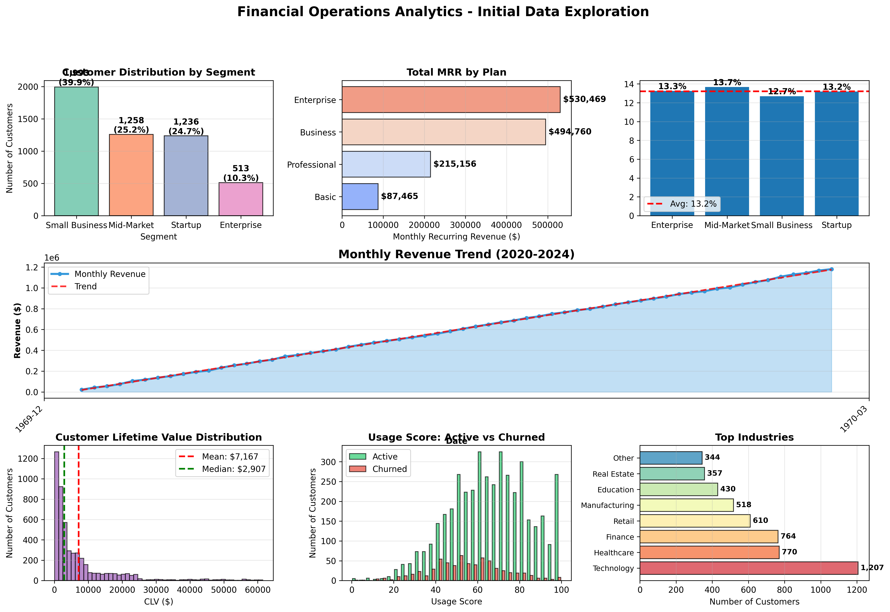
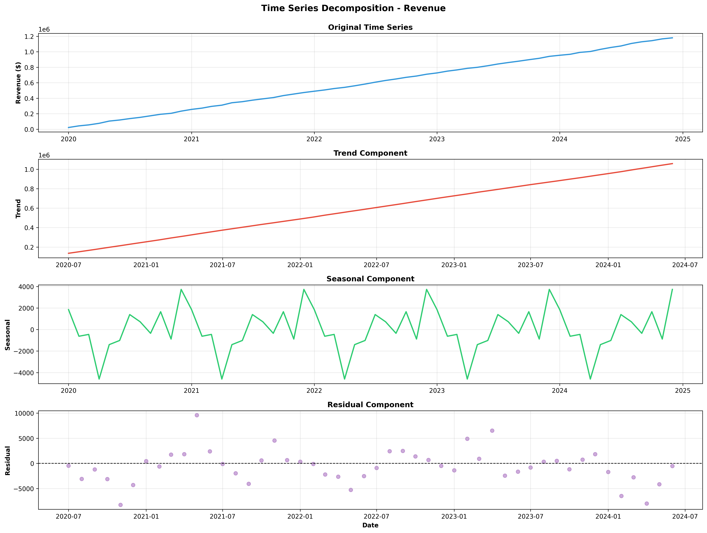
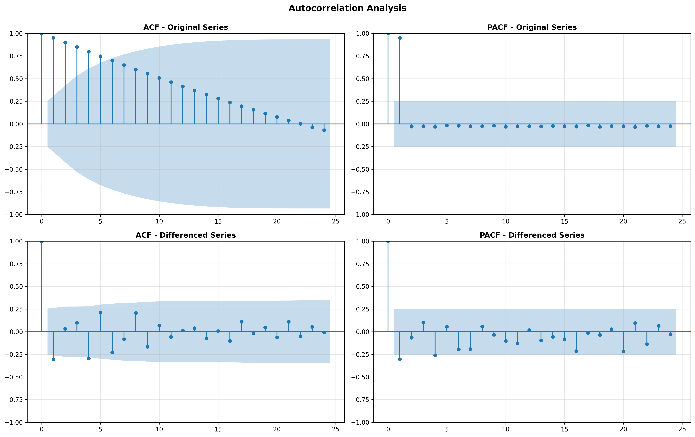
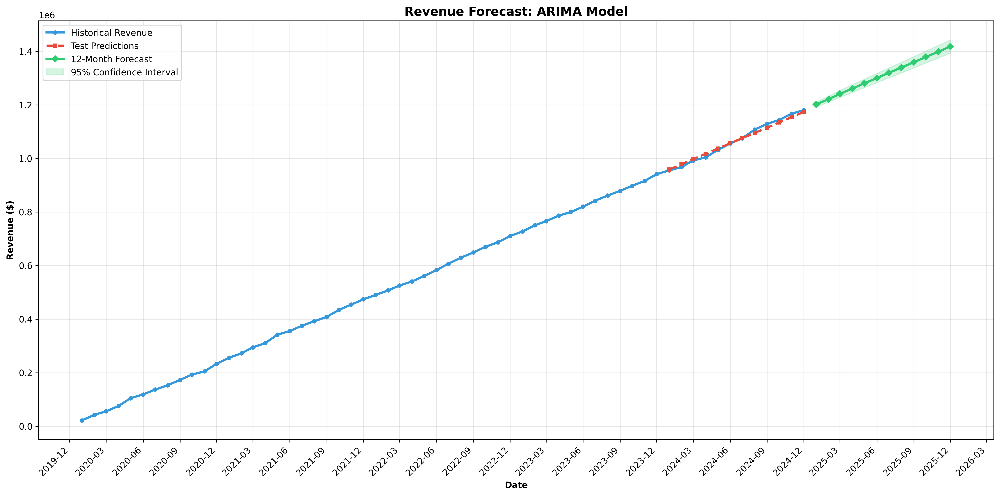

# FINANCIAL_OPERATIONS_ANALYTICS_PROJECT
Financial Operations Analytics Project

End-to-End Analytics Pipeline for Financial Services

This project presents a complete financial analytics solution covering revenue forecasting, churn prediction, customer segmentation, and profitability analysis. It simulates a real-world banking / SaaS / financial services environment and demonstrates how data-driven insights support strategic business decisions.

🚀 Project Overview

Domain: Banking | SaaS | Financial Services
Focus Areas: Revenue Growth, Customer Retention, Risk & Profitability
Type: End-to-End Data Analytics & Modeling Project

The project is structured as a comprehensive analytics workflow, starting from data exploration and ending with a KPI-driven executive dashboard.

🧠 Analytics & Techniques Used
1.Time Series Analysis
2.ARIMA-based revenue forecasting
3.Seasonality and trend decomposition
4.Churn Analysis
5.Logistic Regression
6.Random Forest Classifier
7.Churn probability and risk scoring
8.Customer Analytics
9.RFM Segmentation
10.Customer Lifetime Value (CLV)
11.Retention and revenue contribution analysis
12.Profitability Analysis
13.Segment-wise profitability
14.Plan-wise revenue insights

❓ Business Questions Answered
📈 Revenue Forecasting

-What is the expected revenue for the next 12 months?
-Are there seasonal patterns in revenue?
-What factors drive revenue growth?
-What is the overall revenue trend and growth rate?

🔄 Churn Analysis

1.Which customers are most likely to churn in the next 3 months?
2.What are the key indicators of customer churn?
3.What is the financial impact of churn?
4.How does churn vary across customer segments?
5.How does CLV differ by customer segment?
6.Revenue contribution of active vs churned customers

👥 Customer Segmentation

1.Can we identify distinct customer groups for targeted strategies.
2.Which segments are the most profitable?
3.Plan-wise profitability comparison

FINANCIAL_OPERATIONS_ANALYTICS_PROJECT/
│
├── financial_viz/
│   ├── 01_initial_exploration.ipynb
│   ├── 02_ts_decomposition.ipynb
│   ├── 03_acf_pacf_analysis.ipynb
│   ├── 04_arima_forecast.png
│
├── datagen.ipynb
├── file1.ipynb
│
├── financial_customers.csv
├── financial_transactions.csv
├── monthly_revenue.csv
├── top_50_high_risk_customers.csv
│
└── README.md

## Power BI Dashboard (Points)

1.Built an interactive Power BI dashboard to analyze customer profitability and CLV.
2.Visualized key metrics such as Total Revenue, Average CLV, and Customer Lifetime.
3.Used scatter plots to show the relationship between lifetime and CLV.
4.Performed segment-wise analysis for Enterprise, Mid-Market, Small Business, and Startup customers.
5.Implemented DAX measures for revenue and CLV calculations.
6.Designed KPI cards for quick business insights.
7.Enabled filters and slicers for dynamic analysis.
8.Focused on retention-driven revenue insights.

📊 Summary Dashboard & KPIs

1.The final stage of the project generates a business-ready KPI summary, including:

-Customer Metrics
-Total Customers
-Active vs Churned Customers
-Overall Churn Rate
-Revenue Metrics
-Monthly Recurring Revenue (MRR)
-Annual Recurring Revenue (ARR)
-Total Revenue to Date
-Average Revenue per Customer
-Customer Value Metrics
-Average & Median CLV
-Average Customer Lifetime
-Risk Metrics
-High-Risk Customers (based on churn probability)
-Revenue at Risk
-Potential Annual Revenue Loss

This dashboard enables executive-level decision-making by highlighting growth opportunities and financial risks.
🛠️ Tools & Libraries

Python

Pandas, NumPy

Matplotlib, Seaborn

Scikit-learn

Statsmodels

📌 Key Takeaways

-Demonstrates real-world financial analytics workflows
-Combines forecasting, ML, and business KPIs
-Designed for interview discussion and portfolio presentation
-Strong focus on business impact, not just models

📬 Author

Mahak Bisht
Data Analytics & Financial Analytics Enthusiast

=======
# 💼 Financial Operations Analytics Project

## 🚀 Driving Revenue Growth, Reducing Churn & Optimizing Profitability

This project simulates a real-world financial services environment where data is leveraged to drive **strategic decision-making** across revenue forecasting, customer retention, and profitability optimization.

It focuses on **business impact**, translating data insights into actionable strategies.

---

## 🎯 Business Objective

Organizations in banking and SaaS often face:

- Unpredictable revenue trends  
- High customer churn leading to revenue loss  
- Limited visibility into customer value and profitability  
- Inefficient targeting and retention strategies  

👉 This project addresses these challenges using data-driven analytics.

---

## 💡 Key Business Impact

- Identified **~13% customer churn**, estimating **~$2M potential revenue loss**  
- Segmented customers using **RFM analysis**, enabling targeted retention strategies  
- Forecasted revenue trends using **ARIMA**, supporting financial planning  
- Identified **high-risk customers**, enabling proactive intervention  
- Improved visibility into **Customer Lifetime Value (CLV)** and profitability  

---

## 📊 Key Visual Insights

### 🔹 Customer Segmentation & Revenue Overview

**Insights:**
- Majority customers belong to mid-market and enterprise segments  
- Higher churn observed among low-engagement users  
- Revenue shows an upward trend with seasonal fluctuations  
- High CLV customers contribute significantly to long-term revenue  

---

### 🔹 Time Series Decomposition

**Insights:**
- Clear trend and seasonal patterns observed in revenue  
- Helps in understanding growth stability and forecasting  

---

### 🔹 ACF & PACF Analysis

**Insights:**
- Identified autocorrelation patterns for ARIMA model selection  
- Improved forecasting accuracy  

---

### 🔹 Revenue Forecasting

**Insights:**
- Predicted future revenue trends  
- Supports budgeting, planning, and growth strategy  

---

## 📊 Analytics Workflow

### 🔹 Data Preparation
- Cleaned and validated datasets (customers, transactions, revenue)  
- Ensured data consistency and handled missing values  

### 🔹 Revenue Forecasting
- Applied **Time Series Analysis (ARIMA)**  
- Identified trends and seasonal patterns  
- Predicted future revenue  

### 🔹 Churn Prediction
- Built models using **Logistic Regression & Random Forest**  
- Calculated churn probability and risk scores  
- Identified key churn drivers  

### 🔹 Customer Segmentation
- Performed **RFM Segmentation**  
- Identified high-value and at-risk customers  
- Analyzed revenue contribution by segment  

### 🔹 Profitability Analysis
- Evaluated segment-wise and plan-wise profitability  
- Calculated Customer Lifetime Value (CLV)  

---

## 📈 Business Questions Answered

- What will be the **future revenue trend**?  
- Which customers are likely to **churn soon**?  
- What is the **financial impact of churn**?  
- Which customer segments generate the **highest revenue**?  
- How can retention strategies improve profitability?  

---

## 📊 Dashboard & KPIs (Power BI)

Developed an interactive dashboard to support executive decision-making.

### 🔑 Key Metrics:
- Total Customers & Active Users  
- Churn Rate  
- Monthly & Annual Revenue (MRR, ARR)  
- Average Revenue per Customer  
- Customer Lifetime Value (CLV)  
- Revenue at Risk  
- High-Risk Customers  

👉 Enables quick identification of growth opportunities and risks.

---

## 🛠️ Tools & Technologies

- **Python** (Pandas, NumPy)  
- **Machine Learning** (Scikit-learn)  
- **Time Series Analysis** (Statsmodels - ARIMA)  
- **Visualization** (Matplotlib, Seaborn)  
- **Power BI**  

---

## 📁 Project Structure
FINANCIAL_CAPSTONE_PROJECT/
│
├── financial_viz/ # Saved visual outputs
├── datasets/ # CSV files
├── notebooks/ # Analysis notebooks
├── dashboard/ # Power BI files
└── README.md

---

## 📌 Key Takeaways

- Built an **end-to-end analytics solution** from raw data to business insights  
- Focused on **decision-making, not just modeling**  
- Demonstrated ability to solve **real-world financial problems using data**  
- Delivered insights for revenue growth, churn reduction, and profitability  

---

## 👤 Author

**Mahak Bisht**  
Aspiring Data Analyst | Business Analytics  

🔗 LinkedIn: https://www.linkedin.com/in/mahak-bisht-79241528a  
🔗 GitHub: https://github.com/mahakb2003

